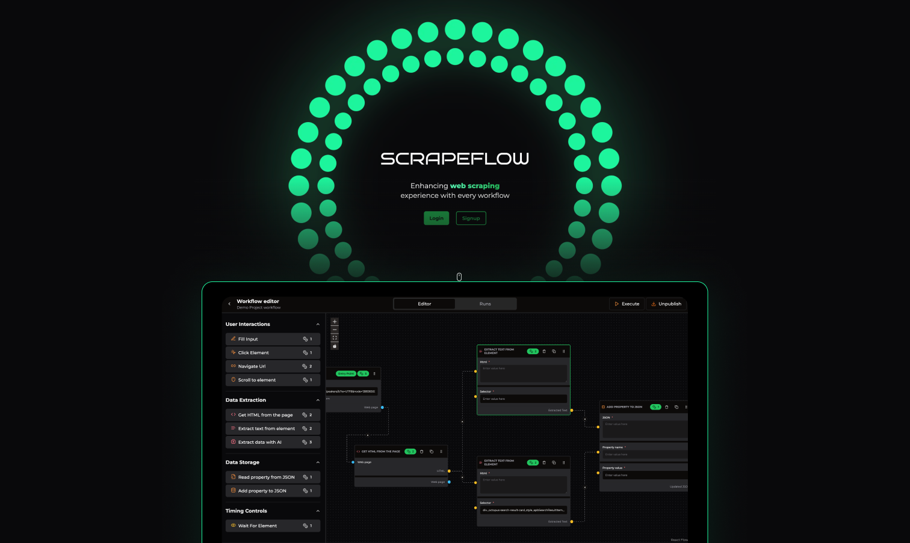

# ScrapeFlow - WebScraping & Data Management SaaS Tool
#### Built With ReactJs, Typescript, NeonDB, PostgreSQL, TailwindCSS, ShadCnUI, Pupeteer, XYFlow, Clerk Auth & Stripe




### Features
- 🕷️ Visual Web Scraping - Create scraping workflows without code
- 📊 Graph-Based Editor - Drag-and-drop nodes to build data flows
- ⏰ Workflow Scheduling - Automate scraping tasks with cron scheduling
- 🔄 Data Transformation - Process and clean data with built-in tools
- 📈 Analytics Dashboard - Monitor workflow performance and results
- 🔐 User Authentication - Secure access with Clerk authentication
- 💳 Subscription Plans - Manage paid tiers with Stripe integration


### Setup Instructions
Run the following in terminal
```bash
git clone https://github.com/vansh2308/website-builder-saas.git
cd ./scrapeflow
npm install
```
Setup your .env file 
```
NEXT_PUBLIC_CLERK_PUBLISHABLE_KEY=
CLERK_SECRET_KEY=

DATABASE_URL=

NEXT_PUBLIC_CLERK_SIGN_UP_URL= /sign-up
NEXT_PUBLIC_CLERK_SIGN_IN_URL= /sign-in
NEXT_PUBLIC_CLERK_SIGN_UP_FORCE_REDIRECT_URL= /setup
NEXT_PUBLIC_CLERK_SIGN_IN_FORCE_REDIRECT_URL= /home

NEXT_PUBLIC_DEV_MODE=false
API_SECRET=

ENCRYPTION_KEY = 

NEXT_PUBLIC_APP_URL=http://localhost:3000/ 
APP_URL = 


NEXT_PUBLIC_STRIPE_PUBLISHABLE_KEY=
STRIPE_SECRET_KEY=

STRIPE_WEBHOOK_SECRET = 


STRIPE_SMALL_PACK_PRICE_ID = 
STRIPE_MEDIUM_PACK_PRICE_ID = 
STRIPE_LARGE_PACK_PRICE_ID = 
```

Open terminal and issue:
```
npx prisma generate
npx prisma db push
npm run dev
```

Voila ;) Just type in http://localhost:3000 in your browser!


### Author
- Github - [vansh2308](https://github.com/vansh2308)
- Website - [Vansh Agarwal](https://portfolio-website-self-xi.vercel.app/)
